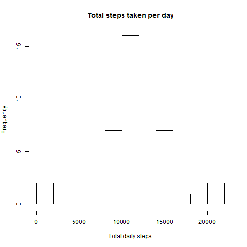
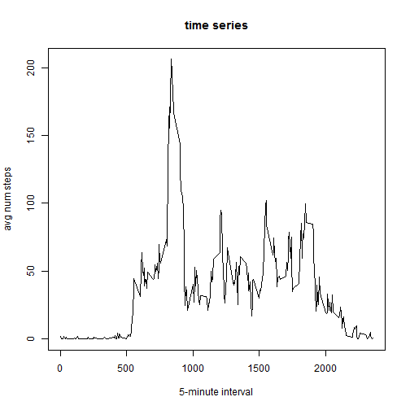
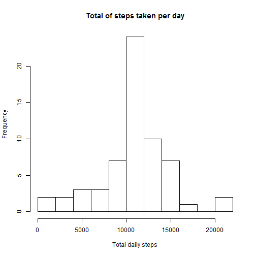
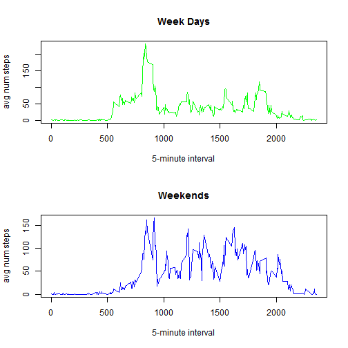

Reproducible Research: Peer Assessment 1
==========================================
Created by David Antelmi, 17th August 2014
  
  
## Basic settings

```r
echo = TRUE  # Always make code visible
```

  
  
## Loading and preprocessing the data

The following code will load the raw data from the working directory into a dataframe.  A copy of the dataset is created excluding the missing values.


```r
activity <- read.csv(unz("activity.zip", "activity.csv"), header = TRUE)
activity$date <- as.Date(activity$date)
activity_noNA <- subset(activity, !is.na(steps))
```

  
## What is mean total number of steps taken per day?

Apply some aggregation to sum up all of the step counts for each day and display on a histogram using base plotting. 


```r
activity_daily <- aggregate(activity_noNA$steps, by = list(activity_noNA$date), FUN = "sum")
colnames(activity_daily) = c("date", "steps")
hist(activity_daily$steps, xlab = "Total daily steps", breaks = 8, main = "Total steps taken per day")
```

 

The mean and median total number of steps can be calculated as follows:


```r
mean(activity_daily$steps)
```

```
## [1] 10766
```

```r
median(activity_daily$steps)
```

```
## [1] 10765
```
 
  
## What is the average daily activity pattern?

Apply some aggregation to average the step counts for each interval and display on a line plot using base plotting.


```r
activity_intervals <- aggregate(activity_noNA$steps, by=list(activity_noNA$interval), FUN = "mean")
colnames(activity_intervals) <- c("interval", "steps")
plot(activity_intervals, type="l", main = "time series", xlab = "5-minute interval", ylab="avg num steps")
```

 

The interval that contains the maximum number of steps across all days is simply given by the maximum value in the data frame calculated in the previous step.


```r
activity_intervals[activity_intervals$steps ==  max(activity_intervals$steps),]
```

```
##     interval steps
## 104      835 206.2
```


  
## Imputing missing values

The missing values are given by the following


```r
sum(is.na(activity$steps))
```

```
## [1] 2304
```


The following code fills in missing values with the mean for the 5-minute interval.  A loop iterates through the steps columns and does a lookup of the mean value from the previously calculated intervals aggregates.


```r
activity.filled <- activity

for (i in 1:nrow(activity.filled)) {
    if (is.na(activity.filled$steps[i])) {
        activity.filled$steps[i] <- activity_intervals[which(activity.filled$interval[i] == activity_intervals$interval), ]$steps
    }
}
```


The histogram for the new filled activity data is given by:


```r
hist(aggregate(activity.filled$steps, by = list(activity.filled$date), FUN = "sum")[,2], xlab = "Total daily steps", breaks = 8, main = "Total of steps taken per day")
```

 

The mean and median shows that this fill technique results in the same mean value as seen in the original data.


```r
mean(aggregate(activity.filled$steps, by = list(activity.filled$date), FUN = "sum")[,2])
```

```
## [1] 10766
```

```r
median(aggregate(activity.filled$steps, by = list(activity.filled$date), FUN = "sum")[,2])
```

```
## [1] 10766
```

  
  
## Are there differences in activity patterns between weekdays and weekends?

A new feature is added to the filled dataset to help analyse patterns between week days and weekends.  
- a day name column is added to the data frame and evaluated using the "weekdays" function.  
- a weekday / weekend dimension is created and merged to produce a day.type factor.  


```r
activity.filled$day.name <- weekdays(activity.filled$date, )
dtlookup = as.data.frame(cbind(c("Monday","Tuesday","Wednesday","Thursday","Friday","Saturday","Sunday"), c("weekday","weekday","weekday","weekday","weekday","weekend","weekend")))
 colnames(dtlookup) = c("day.name", "day.type")


activity.filled <- merge(activity.filled, dtlookup, by.x = "day.name", by.y = "day.name", sort = FALSE)

levels(activity.filled$day.type)
```

```
## [1] "weekday" "weekend"
```


Now that we have an activity dataset with additional features that distinguish week days and weekends, subsetting and aggregation are used to calculate the required interval averages.  The time series for each can then be plotted.


```r
# Create a weekday only df
activity.wd <- subset(activity.filled, activity.filled$day.type == "weekday")

activity.wd.avg <- aggregate(activity.wd$steps, by=list(activity.wd$interval), FUN = "mean")
colnames(activity.wd.avg) <- c("interval", "steps")


# Create a weekend only df
activity.we <- subset(activity.filled, activity.filled$day.type == "weekend")

activity.we.avg <- aggregate(activity.we$steps, by=list(activity.we$interval), FUN = "mean")
colnames(activity.we.avg) <- c("interval", "steps")

# plot the datasets on a panel
par <- par(mfrow = c(2, 1))
plot(activity.wd.avg, type="l", col = "green", main = "Week Days", xlab = "5-minute interval", ylab="avg num steps")
plot(activity.we.avg, type="l", col = "blue", main = "Weekends", xlab = "5-minute interval", ylab="avg num steps")
```

 

